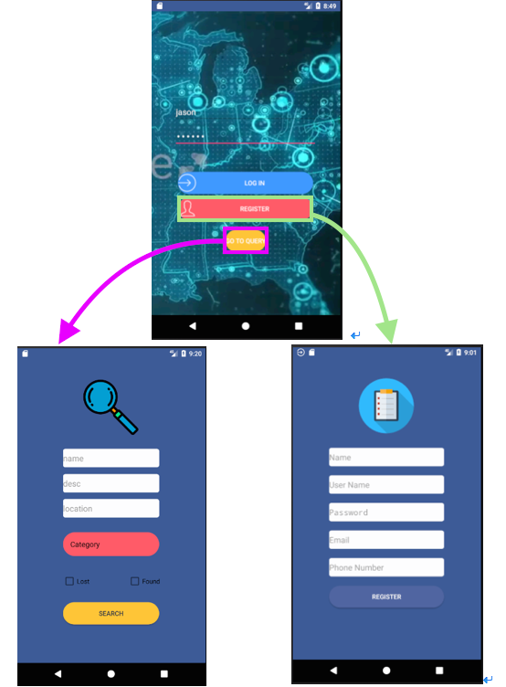
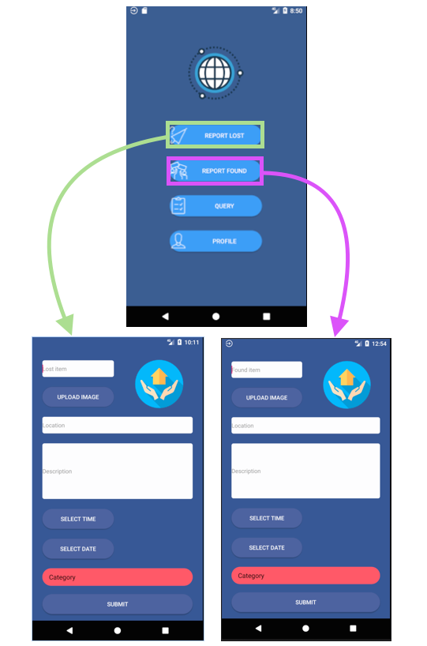
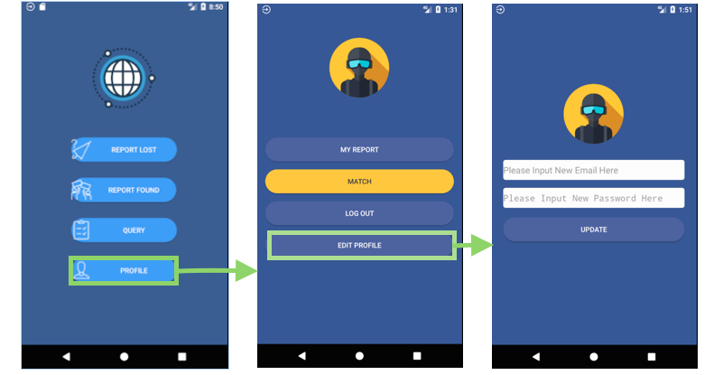
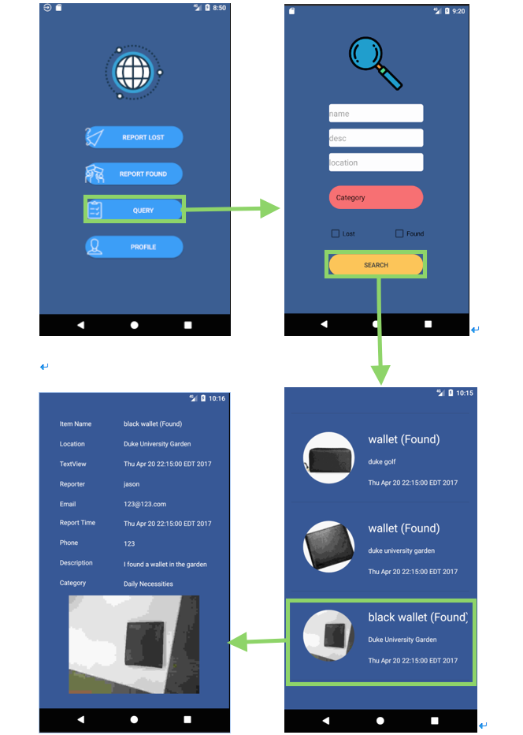
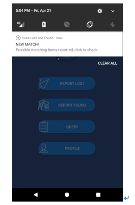

# DUKE LOST & FOUND Mobile Application
**Developed by** *F4*  
**Team Member** *Yuxiang Huang, Jiankun Chen, Si Zhang, Chenqi Zhao*
## Overview
<b>Duke Lost & Found</b> is the mobile app based on Android. It aims to help students and faculty easier to find their lost things or the owner of the property they found. 

## Motivation
Our idea is inspired by a true story that one of our teammates Chenqi found a bunch of keys by accident on campus, but had no idea how to contact the owner.

Via further research online, we found that in U.S, approximately 1.24 item per year get lost for one person but only less than half of them have ever been retrieved. The average cost of a lost item can be up to $220.15 (Mozy, 2016). 

Thus, our team aims to build an app that acts as a platform to facilitate the communication between people who lost their items and those who have found the item.

### Function Overview
This Android app makes it convenient for users to report their lost/found items, search the item in the query board and find the potential matched reporter as soon as possible. Specifically, it has the following functionalities:    
**Registration/Login**: User can register, log in, log out and change account in our app.     
**User Profile**: User can preview/edit his/her profile in our app and change his/her password, contact information. This view can be accessed when the user has logged in.     
**Report found item**: Logged-in users who find an item can report what they have found with description such as name of the found item, location where the item was found, and the time and date when s/he found it.     
**Report lost item**:  Logged-in users can report their lost item, with description such as name of the lost item, location where the item was lost, user-input description of the item s/he lost, and the time and date when s/he lost it.      
**Query function**: This can be accessed by user without login. Users can specify the category, key word, location to search the items other users have reported in our app.
**Match function**: Our app will automatically match the lost and found item info posted by users, and send related users the notification. This function can also be manually accessed in User Profile.      

### Tech Stack Overview
For the frontend part, we use Java to create Android UI view in Android Studio 
We use OkHttp as the framework to help us send Http request and receive response  
In backend, we run Django in Duke OIT virtual machine (<b>please connect to our server within Duke network</b>)
We use SQLite as our database to store the user information and item information
## code structure overview
### Code structure
Throughout our code development, we use 3 subfolders:
**manifest** has an xml file that provides necessary information to the Android system to run the code.
**java** contains JAVA classes that implements the internal logic of the views.
**res** mainly includes the activity layouts that implements the design of UI.

### Frontend
#### jave files
<code>f4_ui_2/app/src/main/java/com/example/zhangsi929/f4_ui_1</code> contains the java files for the project frontend 
<code>FoundReport</code> <code>LostReport</code> can report the found/lost items to the backend 
<code>LoginActivity</code> <code>RegisterActivity</code> can handle user authentication activities 
<code>MainActivity</code> is the home page of the App. User can go to differetn views from this view. It send matching query to backend every six hours 
<code>QueryActivity</code> send user's query to backend, and pass the backend response to <code>Infoview</code>  
<code>InfoView</code> <code> DetailView</code> receive query response from backend and show them to user  
<code>MatchingResults</code> receive matching response from backend and show them to user  
<code>ProfileResults</code> allows user to check report history, update profile, sent match query and logout  
#### UI design
<code>f4_ui_2/app/src/main/rec</code> contains the files and resources for UI design 
<code>/drawable</code> folder contains all images and icons for the project 
<code>/layout</code> folder contains all .xml files shows the graphical interface of the project 
<code>/values</code> folder contains the color, dimens and text resources of UI 

### Backend
<code>f4_server/server/urls.py</code> contains API for the project 
in <code>f4_server/app/views.py</code> contains the logic handler for the server  
<code>insert_found</code> <code>insert_lost</code> can insert the found and lost item 
<code>query</code> can get the query result from the database 
<code>distanceMatch</code> can access the Google Map service and match the location  
<code>match</code> can match the potential items in the database  
<code>update_profile</code> can update the user profile

## Installation & Execution
### Frontend
   Please use Android Studio to compile and run our app, before running, we suggest you <b>clean</b> the project
   <b>Please make sure you run our app within Duke network or using Duke VPN</b>
### Backend
   We use Duke OIT virtual machine to run our server and database.
   Before running our app, please make sure you have installed python3, Django and SQLite in your machine and those can be accessed in your current path and your environment. 
   Before you start our server, we strong suggested you run the Django Testcase to make sure everything is fine. 
   To run the Testcase: 
    <code>./manage.py test</code> 
   To run the server: 
    <code>python3 manage.py runserver</code>
    
## API Reference
### login
use POST method 
http://colab-sbx-pvt-10.oit.duke.edu:8000/accounts/login 
the json body must include the "username"(string) and "password"(string) 
example: 
<code>
{
	"username": "chenqi123",
	"password": "123123"
}
</code>

### log out
use POST method 
http://colab-sbx-pvt-10.oit.duke.edu:8000/accounts/logout
### sign up
use POST method 
http://colab-sbx-pvt-10.oit.duke.edu:8000/accounts/signup 
json body must include "name"(string), "username"(string), "password"(string), "email"(string), "phone"(integer) 
example: 
<code>
{
	"name":"chenqi",
	"username": "chenqi123",
	"password": "123123",
	"email": "chenqi.zhao@duke.edu",
	"phone": 9823223
}
</code>
### post to lost
http://colab-sbx-pvt-10.oit.duke.edu:8000/app/lost 
json body must include "item_name"(string), "lost_time"(string, ISO format)."username"(string) 
 "lost_location"(string) and "lost_desc"(string) are optional 
example: 
<code>
{
	"item_name":"iphon7",
	"lost_time": "2017-03-03T13:15:30Z",
	"username":"chenqi123",
	"lost_location": "Duke University West Union",
	"lost_desc": "This is a black iphone7 with black protector case",
	"lost_category": 1
}
</code>
### POST to found
http://colab-sbx-pvt-10.oit.duke.edu:8000/app/found 
json body must include "item_name"(string), "found_time"(string, ISO format), "username"(string). 
 "found_location"(string) and "found_desc"(string) are optional 
example: 
<code>
{
	"item_name":"mac pro",
	"found_time": "2017-03-03T13:15:30Z",
	"username":"chenqi123",
	"found_location": "Duke University Hudson Building",
	"found_desc": "It's a found item",
	"found_category": 1
}
</code>
### query
use GET method 
http://colab-sbx-pvt-10.oit.duke.edu:8000/app/query/?name={item_name}&category={category_classify}&found={true/false}&lost={true/false}&description={item_description_key_word}&location={location_description} 
item_name: the key word in item name 
category_classify:  
0.Pet 
1.Clothing 
2.Book 
3.Electronics 
4.Daily Necessities 
5.other  
item_description_key_word: the key word used for searching in description 
location_description: the key word used in estimating the distance 
When use this API, we must provide the boolean value for found and lost. Other parameters are optional 
The response for the query is also json formate 
the response json body contains key "found_items", "lost_items"
### match
use GET method 
http://colab-sbx-pvt-10.oit.duke.edu:8000/app/match/?username={username}
### edit profile
use POST method 
http://colab-sbx-pvt-10.oit.duke.edu:8000/app/profile/update 
the json body must contain the "username"(string), and "email"(string) and "password"(string) are optional 
example: 
<code>
{
	"username":"chenqi123",
	"email": "chengqi@duke.edu",
	"password": "password"
}
</code>
### Get all reported items 
use GET method 
http://colab-sbx-pvt-10.oit.duke.edu:8000/app/reported/?username=chenqi123 
### to access our admin page in the server
[http://colab-sbx-pvt-10.oit.duke.edu:8000/admin/](http://colab-sbx-pvt-10.oit.duke.edu:8000/admin)  
You can user username: chenqi123   password:aaaaaa to access the admin page as a system administrator in our project.

## Server Tests
We use <b> Django Testcase</b> as the framework to do the unit test for our server.
In <code>F4_server/app/tests.py</code> we created server test cases to do different part of unit test 
<b>ReporterTestCase</b> tests the user table in the database 
<b>LostItemTestCase</b> and <b>FoundItemTestCase</b> test the lost and foudn table in database 
<b>GoogleAPITestCase</b> tests connection with Google Map service 
<b>QueryTestCase</b> test the different kinds of query function

## Support Manual

**1.Introduction**

The DUKE LOST& FOUND Android Mobile App is intended to help you report the lost and found items and search the item around Duke University. After installing the Mobile App, you will be able to: 

- report lost item with contact information, location and description  
- report what they have found with contact information, location and description.  
- query an information board where user can search by name, location, date and category, then see a list of items, with each displaying the photo of the item that matches your specified qualification.
    
 
 

**2.Application Usage Overview**

After installing the Mobile App, you can enjoy the following functionalities:

- *Registration/Login*: User can register, log in, log out and/or edit the account information. 
- *User Profile*: A User Profile which contains user's basic bio-information will be automatically set up for the user after the registration process. A user can view his/her profile after login. 
- *Report found item*: Logged-in users who have found an item can report what they have found with description such as name of the found item, location where the item was found, and the time and date when s/he found it. 
- *Report lost item*: Logged-in users can report their lost item, with description such as name of the lost item, location where the item was lost, user-input description of the item s/he lost, and the time and date when s/he lost it.       
- *Query*: This function can be accessed by user without logged-in status. Users can view a list of item information that has already been posted on the information board, after specifying the item that they want to search. For example, users will be prompted to specify whether the item s/he wants to search is a lost item or found item, category of the item, description of the targeted item, and location where the item might be lost or is found.  
- *Information Board*: After a user submits his/her customized search, s/he would be directed to the Information Board, which list all the items that satisfy user's query.      
- *Match*: Our app will automatically match the lost and found item information posted by users, and send notifications to related users. This function can be manually accessed in User Profile. 
    
ps: Registration required for *REPORT LOST* and *REPORT FOUND*. If you have not signed up yet, clicking on this button will lead you to the *User Login* page. 

 
 

**3.Registration and Login** 
 
After entering DUKE LOST&FOUND app, this is the first view users see. 

If you do not intend to post information and just want to search in the information board, just click on *GO TO QUERY* button.

However, in order to post found/lost information, you need to sign in using the *username *and *password *of your account.

If you do not have an account signed up yet, click Register and you will be prompted to enter the necessary information as shown below.

**4.Main Menu**

After login, the main menu page will be displayed.
Here, you can choose whatever function you want to use.

- *Report Lost Item*     
After clicking *REPORT LOST* in the main menu view, you will jump to this view, as shown below. Here, you type in the information of the item you lost, with entries such as lost item name, location, description and select the time and date when you lost it. To make it more intuitive and simple, you may want to click on the *UPLOAD IMAGE* icon to upload the image of your lost item in your phone's local album, if there is any.

- *Report Found Item*     
After clicking *REPORT FOUND* in the main menu view, you will jump to this view, as shown below. Here, you type in the information of the item you found, with entries such as found item name, location, description and select the time and date when you found it. To make it more intuitive and simple, you can take a photo of the item you found and save it in your phone's local album, then click on the *UPLOAD IMAGE* icon in this view to upload the image. 

- *User Profile*        
In login status, you can access your own *Profile* as shown below, which documents the information you entered when register. makes it convenient for others to get in touch with you in the circumstance where you find an item. Mutually, you can easily get in touch with another person who has found your lost item.

  

- *Query*   

In this view, you first need to enter necessary information about the item you are looking for. Our app enables you to narrow down the search by specifying the category of the item, location to query, and choosing whether the item you are looking for is found or lost. You may also add some description to it to make your query more accurate and specific.  

After clicking on the *Search* button, you will be directed to the actual query board, where you can see the information posted by others about their lost/found item.  

Here, If you would like to query information about one specific entry, click on that and then you will be directed to another page as shown below, where you can see the detailed information related to that item.

If the item description matches what you are looking for,
then congratulations! Go contact the person via E-mail and/or Phone number and schedule a time to return/ retrieve the item.

 
 

**5. Notification**

Our match function will automatically send two users notification if they are found to have posted ...graded already？！

## Document reference 
For the System Architecture and design details, please refer to final_doc_f4.pdf in Sakai.

## Contributors
Yuxiang Huang: Architecture design, backend built, data transfer 
Jiankun Chen: Database design/implement, backend built, API design 
Si Zhang: UI design, frontend built, test 
Chenqi Zhao: frontend built, data transfer, test 

